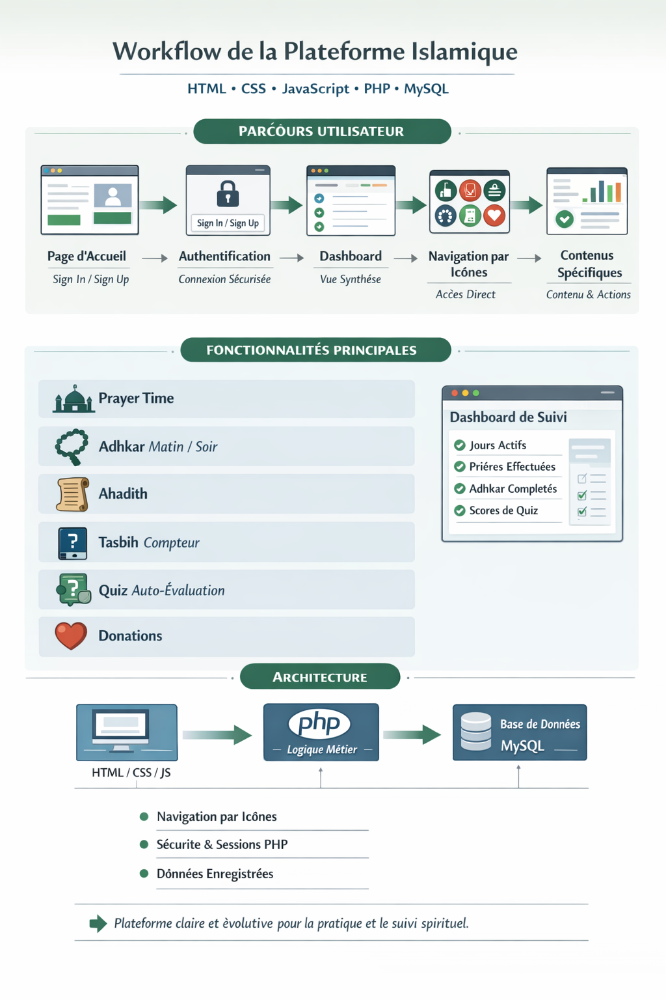
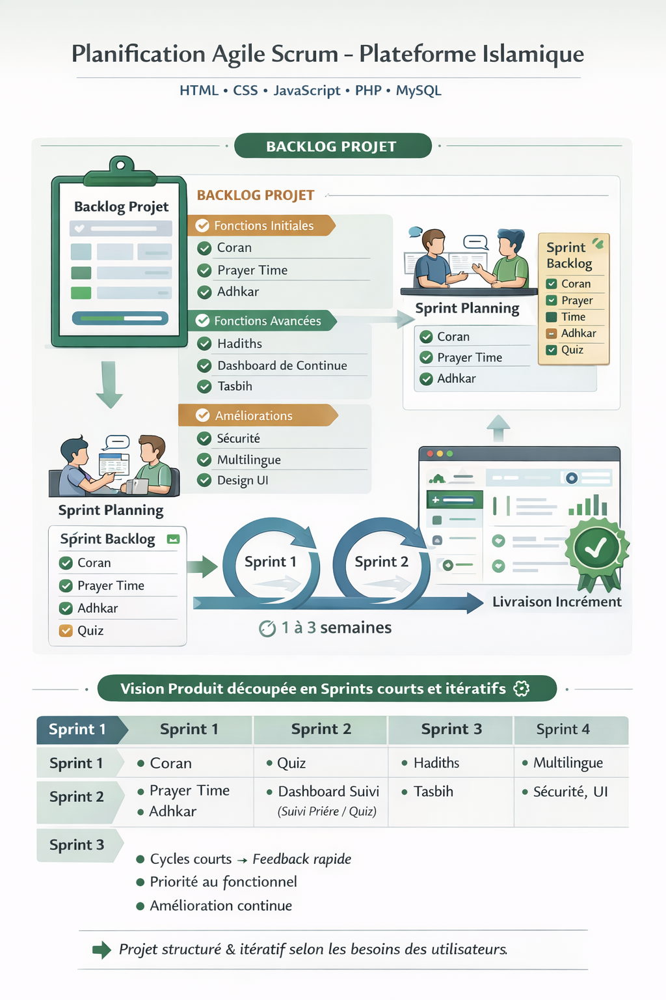
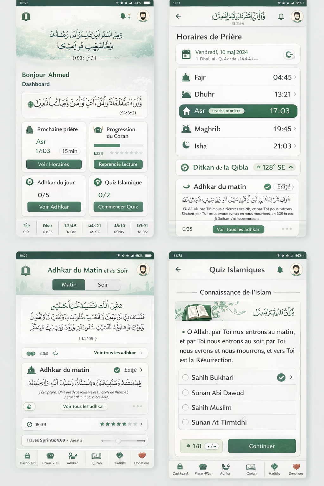

# Projet_Web_2026
# Plateforme Web Islamique

Une plateforme web mobile-friendly pour pratiquer, apprendre et suivre la régularité spirituelle.

---

## Technologies utilisées

                +----------------+
               |  Frontend      |
               | HTML / CSS / JS|
               +--------+-------+
                        |
                        v
               +----------------+
               |  Backend       |
               | PHP            |
               +--------+-------+
                        |
                        v
               +----------------+
               |  Database      |
               | MySQL          |
               +----------------+
                        |
                        v
             +----------------------+
             | Optional Libraries   |
             | Bootstrap / Icons   |
             +----------------------+

## Fonctionnalités principales
- 🕌 **Prayer Time** : horaires et validation des prières
- 📿 **Adhkar** : adhkar matin / soir avec suivi
- 📜 **Hadith** : lecture des hadiths classés par thème
- 🔢 **Tasbih** : compteur numérique
- ❓ **Quiz** : auto-évaluation et suivi
- ❤️ **Donations** : information et redirection
- 📊 **Dashboard** : suivi des jours actifs, prières, adhkar et quiz

---

## Parcours utilisateur
1. Page d’accueil → présentation + accès **Sign in / Sign up**
2. Authentification sécurisée
3. Dashboard avec vue synthèse de l’activité
4. Navigation par icônes vers chaque module
5. Contenu interactif spécifique à chaque fonctionnalité
6. Suivi de la continuité et progression spirituelle
#      voila notre workflow 

## methodologie_choisi_scrum:

 ## exemple interface

