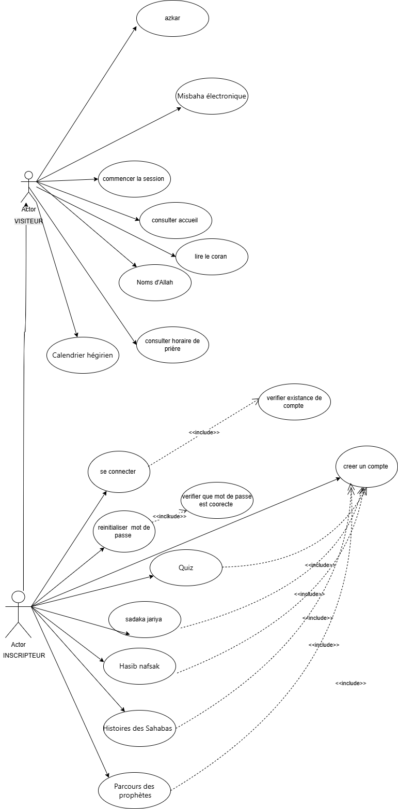

# FaithPath
curl -fsSL https://cli.coderabbit.ai/install.sh | sh

## 1) Présentation

FaithPath est une plateforme web orientée accompagnement spirituel, avec une interface en arabe (RTL) et une navigation centrée sur les besoins quotidiens de l’utilisateur.

Fonctionnalités principales:

- Lecture du Coran
- Noms d’Allah
- Horaires de prière
- Direction de la qibla
- Azkar et misbaha électronique
- Authentification (connexion, inscription, mot de passe oublié, reset)
- Quiz, Hasib nafsak, Sadaka jariya, histoires des Sahabas, parcours des prophètes

## 2) Conception de la page d’accueil

La page d’accueil est conçue comme un hub central:

- En-tête avec branding FaithPath et menu hamburger
- Navigation latérale avec distinction entre fonctionnalités ouvertes et verrouillées
- Section hero avec accroche, statistique et ambiance visuelle islamique
- Grille de cartes de services pour un accès rapide aux modules
- Blocs de contenu spirituel (ayah du jour, hadith)

Choix de conception:

- Palette verte et dorée pour la sérénité et l’identité islamique
- Support complet RTL
- Cartes modulaires avec icônes et visuels
- Hiérarchie visuelle claire pour guider l’utilisateur

## 3) Architecture technique

- Frontend: pages HTML, styles CSS, scripts JavaScript
- Backend: endpoints PHP pour login, signup, forgot password et reset password
- Stockage/BDD: interactions représentées dans les diagrammes de séquence

## 4) Diagrammes du projet

### 4.1 Diagramme de cas d’utilisation (version 1)

### 4.2 Diagramme de cas d’utilisation (version drawio)

### 4.3 Diagramme de séquence Connexion

### 4.4 Diagramme de séquence Inscription

.png)

### 4.5 Diagramme de séquence Mot de passe oublié

### 4.6 Diagramme de séquence Reset mot de passe

## 5) Technologies utilisées

- HTML5
- CSS3
- JavaScript
- PHP
- Font Awesome
- Google Fonts

## 6) Organisation des dossiers

- frontend: interfaces utilisateur, styles, scripts et images
- backend: endpoints PHP et logique serveur
- data: données de support

Note: les ressources image utilisées par le frontend sont maintenant regroupées sous frontend/img pour simplifier les chemins.

